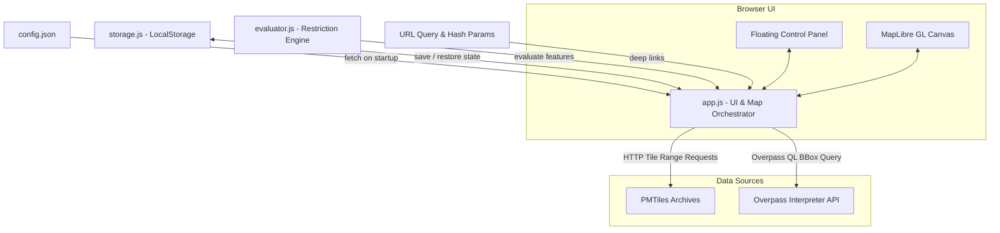

# Requirements

### Overview & Goals
The objective of this project is to enhance Parkhour with automated test coverage across all existing features, transition the default data provider from Overpass to PMTiles (protecting public Overpass servers from heavy load), provide preconfigured hosted PMTiles areas and selectable Overpass server endpoints via a central configuration file, persist user settings across sessions in `localStorage`, and ensure seamless deep-linking via PMTiles URL parameters.

### Scope
- **In Scope:**
  - Automated test suite covering all existing features using Vitest (unit/integration) and Playwright (end-to-end browser tests).
  - Modular refactoring of core parking evaluation and storage logic into clean, testable ES modules (`evaluator.js`, `storage.js`).
  - Transitioning the default initial data source to PMTiles vector tiles instead of Overpass API.
  - Adding `config.json` to configure hosted PMTiles areas and Overpass server endpoints.
  - UI updates in `index.html` and `style.css` to offer dropdown selectors for hosted PMTiles areas and Overpass servers with fallback to custom URLs.
  - Persisting map state (bounding box/center, zoom), active data source, selected PMTiles file, and Overpass endpoint across browser sessions via `localStorage`.
  - Immediate loading and evaluation of PMTiles archives when specified as URL parameters (e.g. `?pmtiles=...`).
  - Maintenance of `FEATURES.md`, end-user documentation (`documentation/user_guide.md`), developer documentation (`documentation/developer_guide.md`), and delivery report in `.junie/reports/`.

- **Out of Scope:**
  - Modifying OSM PBF extraction shell scripts (`make_pmtiles.sh`, `install_prereqs.sh`) unless required for PMTiles compatibility.
  - Updating or maintaining `ultra-version.yaml` (legacy configuration that is left intact for users who want it, but no longer requires updates).
  - Setting up remote server-side backend services (the app remains a static, client-side application deployable via GitHub Pages).
  - Replacing MapLibre GL JS with another mapping library.

### User Stories
- **As a visitor**, I want the map to load instantly using local/hosted PMTiles by default so that the application loads fast without hitting rate limits or putting undue load on community Overpass servers.
- **As a user exploring parking**, I want to pick from a list of preconfigured cities/areas (such as Sacramento Core or Northern California) or input my own custom PMTiles URL so that I can view restrictions in areas of interest.
- **As an advanced user**, I want to choose which Overpass server is used when querying Overpass mode (e.g., standard Overpass, Kumi Systems, or a custom instance) to avoid busy or rate-limited endpoints.
- **As a returning user**, I want the map to remember where I left off (my last view position, zoom level, selected server, and PMTiles dataset) so that I don't have to reconfigure the view every time I reopen the browser.
- **As a user sharing a map**, I want to share a direct link with `?pmtiles=<url>&lat=...&lon=...&zoom=...` and have the recipient's map immediately open and render that specific PMTiles archive at those coordinates.
- **As a maintainer**, I want a comprehensive automated test suite (unit + E2E) so that future enhancements do not regress complex restriction logic or map behaviors.

### Functional Requirements
- **FR1: Test Suite for Previous Features**
  - Unit tests using Vitest validating:
    - Direction-agnostic dual offset curbs (left and right curbs evaluated independently).
    - Three-state street curb logic: allowed (`#1e88e5`), restricted later today (`#f1c40f`), restricted right now (`#e53935`), and unmapped/no parking (`#b0bec5`).
    - Parking lot access logic: public/permissive, customers only, private/permit/closed, and unmapped tags.
    - Opening hours evaluation and time-machine interval calculations.
    - Tile coordinate calculations (`lon2tile`, `lat2tile`) and URL parameter parsing.
  - End-to-end tests using Playwright validating DOM controls, radio switching, popup display, and layer rendering.
- **FR2: Default PMTiles Mode**
  - The application must load in PMTiles mode by default on initial visit.
  - Radio button for PMTiles must be pre-checked, and PMTiles controls visible.
  - Initial map load must fetch and render vector tiles from the configured default PMTiles archive without triggering an Overpass API request.
- **FR3: Preconfigured Hosted PMTiles Sets & Custom URLs**
  - Preconfigured PMTiles areas defined in `config.json` must be displayed in a dropdown selector (`#pmtiles-select`).
  - Selecting an area from the dropdown must automatically load its archive and pan/zoom to its extent if currently out of bounds.
  - The dropdown must include a "Custom URL..." option which reveals/focuses a text input for arbitrary PMTiles URLs.
- **FR4: Configurable Overpass Server Setting**
  - A dropdown selector (`#overpass-select`) must list preconfigured Overpass servers loaded from `config.json` alongside a "Custom URL..." option.
  - Selecting a preconfigured server or entering a custom URL must route subsequent Overpass queries to that endpoint.
- **FR5: Session Persistence Across Reloads**
  - State must be saved in browser `localStorage` on change: active data source, selected Overpass server, selected PMTiles area/URL, and map view coordinates (`center` and `zoom`).
  - On launch, the state must be restored with the following precedence order:
    1. URL query / hash parameters (highest priority).
    2. Saved `localStorage` settings.
    3. `config.json` defaults (fallback).
- **FR6: PMTiles URL Parameter Deep-Linking & Auto-load**
  - If a `pmtiles` URL parameter is provided (e.g. `?pmtiles=https://example.com/area.pmtiles`), the application must default to PMTiles mode, set the active PMTiles archive to this URL, initialize the PMTiles instance, and trigger data fetching automatically on load.

### Non-Functional Requirements
- **Code Quality & Guidelines Adherence:**
  - Avoid full file regenerations: apply modular extractions and surgical patches to `app.js` and `index.html`.
  - Maintain clear, expressive code with detailed comments explaining the intent of functions and variables.
  - Document all features in `FEATURES.md` and keep the list synchronized with code changes.
  - Provide developer documentation for APIs and user documentation for interactive UI elements in the `documentation/` folder.
  - Output completion report in `.junie/reports/summary_<date>_<time>.md`.
- **Performance & Reliability:**
  - Initial load should not perform redundant network calls.
  - Debounced tile fetching on map movements.
  - Safe fallback when `localStorage` is unavailable or `config.json` fails to load.

# Technical Design

### Current Implementation
- `app.js` (710 lines) is a single ES module loaded by `index.html`. It contains both domain logic (`parseConditional`, `evaluateParkingLot`, `evaluateSide`, `processFeatures`, tile math) and map/DOM orchestration (`maplibregl.Map`, DOM listeners, popup handler).
- `index.html` loads MapLibre GL, PMTiles, and osmtogeojson via CDN `<script>` tags, and sets the Overpass radio button as default.
- Currently, when a `?pmtiles=...` parameter is supplied, `app.js` updates the input element and dispatches a radio change event, but does not open the PMTiles archive because `activePMTiles` is still `null`.
- There is currently no `package.json`, test suite, configuration file, or session persistence layer.

### Key Decisions
1. **Testing Framework: Vitest with Playwright**
   - *Decision:* Use Vitest for fast, ESM-native unit and integration tests, and Playwright for real browser end-to-end tests.
   - *Rationale:* Vitest natively supports ES modules without transpilation, has built-in jsdom/happy-dom support for DOM assertions, and pairs with Playwright to verify MapLibre GL canvas and DOM interactions across browsers.
2. **Modular Architecture: Extract `evaluator.js` & `storage.js`**
   - *Decision:* Extract pure parking restriction logic into `evaluator.js` and persistence logic into `storage.js`, while retaining UI and MapLibre integration in `app.js`.
   - *Rationale:* Allows comprehensive, fast unit testing in Vitest without needing heavy browser mocks, separates concerns cleanly, and preserves `app.js` patchability.
3. **Configuration Storage: `config.json`**
   - *Decision:* Externalize hosted PMTiles archives and Overpass server endpoints into a root `config.json` file.
   - *Rationale:* Cleanly decouples static configuration from executable code. Non-developers can add hosted PMTiles sets or server endpoints without modifying JavaScript code.
4. **State Restoration Hierarchy**
   - *Decision:* Apply a strict 3-tier precedence: `URL Parameters > localStorage > config.json defaults`.
   - *Rationale:* Shared deep links always override local preferences, while returning users without URL parameters seamlessly pick up where they left off.

### Proposed Changes

#### 1. Configuration (`config.json`)
Create `config.json` at repository root:
```json
{
  "defaultDataSource": "pmtiles",
  "defaultPMTiles": "sac_core.pmtiles",
  "pmtilesAreas": [
    { "name": "Sacramento Core", "url": "sac_core.pmtiles" },
    { "name": "Northern California", "url": "norcal-260906.pmtiles" }
  ],
  "defaultOverpass": "https://overpass-api.de/api/interpreter",
  "overpassServers": [
    { "name": "Main OSM (overpass-api.de)", "url": "https://overpass-api.de/api/interpreter" },
    { "name": "Kumi Systems", "url": "https://overpass.kumi.systems/api/interpreter" },
    { "name": "French OSM Instance", "url": "https://overpass.openstreetmap.fr/api/interpreter" }
  ]
}
```

#### 2. Modular Evaluator (`evaluator.js`)
Extract and export pure functions from `app.js`:
- `parseConditional(str)`: parses OSM conditional restriction strings.
- `evaluateParkingLot(props, now)`: evaluates parking lot accessibility status.
- `evaluateSide(side, props, now)`: evaluates street curb parking status for left/right curbs.
- `processFeatures(geojsonOrFeatures, evalTime)`: processes OSM features into dual-curb and lot representations.
- `lon2tile(lon, zoom)` and `lat2tile(lat, zoom)`: converts geographic coordinates to vector tile indexes.
- `getUrlParam(params, ...keys)`: extracts URL parameters case-insensitively.

#### 3. Session Persistence (`storage.js`)
Create `storage.js` with functions:
- `saveSettings(settings)`: serializes application state (`dataSource`, `overpassUrl`, `pmtilesUrl`, `center`, `zoom`) to `localStorage`.
- `loadSettings()`: safely parses settings from `localStorage` with error handling for private browsing / disabled storage.
- `resolveInitialState(urlParams, savedSettings, config)`: computes initial map view and data source using the defined hierarchy.

#### 4. UI Controls & Presentation (`index.html`, `style.css`, `app.js`)
- In `index.html`:
  - Change default radio button to `pmtiles`: `<input type="radio" name="data-source" value="pmtiles" checked />`.
  - In `#pmtiles-controls`, add `<select id="pmtiles-select">` with preconfigured areas and "Custom URL...".
  - In `#overpass-controls`, add `<select id="overpass-select">` with preconfigured servers and "Custom URL...".
- In `app.js`:
  - Load `config.json` on startup and populate `#pmtiles-select` and `#overpass-select`.
  - Implement dropdown change listeners to update URLs and trigger data loading.
  - Fix PMTiles URL parameter handler: when `pmtiles` URL param is present, load the PMTiles archive immediately and set map bounds.
  - Attach `map.on("moveend")` to persist coordinates and zoom to `storage.js`.

### Architecture Diagram


### File Structure Changes
- **New Files:**
  - `config.json`: Configuration for PMTiles areas and Overpass endpoints.
  - `evaluator.js`: Extracted pure domain logic for restriction evaluation and tile math.
  - `storage.js`: Session persistence logic for `localStorage`.
  - `package.json`: Project scripts and testing dependencies (Vitest, Playwright).
  - `vitest.config.js`: Vitest configuration.
  - `playwright.config.js`: Playwright E2E configuration.
  - `tests/unit/evaluator.test.js`: Unit tests for evaluation logic and previous features.
  - `tests/unit/storage.test.js`: Unit tests for state persistence and hierarchy resolution.
  - `tests/e2e/parking-map.spec.js`: End-to-end browser tests.
  - `FEATURES.md`: Feature registry and maintenance tracking.
  - `documentation/user_guide.md`: End-user guide for interactive features.
  - `documentation/developer_guide.md`: Developer guide for architecture, APIs, and tests.
  - `.junie/reports/summary_<date>_<time>.md`: Final session report.
- **Modified Files:**
  - `index.html`: Update default radio to PMTiles, add dropdown selectors for PMTiles areas and Overpass endpoints.
  - `style.css`: Add styling for new dropdown controls and custom URL toggles.
  - `app.js`: Import `evaluator.js` and `storage.js`, load `config.json`, populate selectors, persist state, and fix PMTiles auto-load on startup and URL param deep links.
  - `README.md`: Update documentation to reflect PMTiles default mode and test runner commands.

### Risks & Mitigations
- **Risk:** CDN dependencies (`opening_hours`, `@mapbox/vector-tile`, `pbf`) in `app.js` and `evaluator.js` might cause module resolution issues in Node test environments.
  - *Mitigation:* Vitest supports ESM imports directly; we will configure `vitest.config.js` or install matching npm packages for Node testing while maintaining ESM browser compatibility.
- **Risk:** Stored `localStorage` coordinates might place user out of bounds for a newly selected PMTiles dataset.
  - *Mitigation:* When a user selects a preconfigured PMTiles dataset or provides a PMTiles URL, `app.js` inspects `activePMTilesHeader.minLon/maxLon` and smoothly flies to the dataset center if the current view does not intersect its bounds.
- **Risk:** Missing or malformed `config.json` could stall application boot.
  - *Mitigation:* Implement defensive fallbacks in `app.js` to ensure the application still functions with hardcoded defaults if `config.json` fails to load.

# Testing

### Validation Approach
Verification consists of a two-tiered testing strategy:
1. **Unit & Integration Tests (Vitest):**
   Run via `npm test`. Fast, isolated tests executing in Node 18 verifying restriction parsing, parking lot evaluation, conditional opening hours logic, tile coordinate calculations, state restoration hierarchy, and configuration parsing.
2. **End-to-End Tests (Playwright):**
   Run via `npm run test:e2e`. Launches a headless Chromium browser running the local static application, validating real DOM interactions, MapLibre GL layer initialization, radio button switching, hosted PMTiles selection, Overpass server selection, and URL hash/query parameter parsing.

### Key Scenarios

#### 1. Evaluation Logic & Prior Features (Unit Tests)
- **Left / Right Dual Curb Evaluation:**
  - Independent conditions for left side (`parking:lane:left:restriction:conditional=no_parking @ (Mo-Fr 08:00-18:00)`) and right side (`parking:lane:right:restriction=free`).
  - Verify left is evaluated as `restricted` (or `restricted_today`) while right is `allowed`.
- **Three-State Curb Logic:**
  - `allowed`: Currently open with no restrictions today.
  - `restricted_today`: Currently open, but with a restriction starting later today (e.g. street sweeping at 14:00).
  - `restricted`: Prohibitive rule actively applies right now.
  - `unmapped`: Street without parking tags.
- **Parking Lot Access Evaluation:**
  - `access=yes`, `access=public`, `access=permissive` -> `allowed`.
  - `access=customers` -> `customers`.
  - `access=private`, `permit`, `residents`, `no` -> `restricted`.
  - No access tag mapped -> `unmapped`.
  - Scheduled closure via `opening_hours` tag -> `restricted` with rule description.
- **Dynamic Time Machine:**
  - Evaluate the exact same feature at `09:00` (restricted) vs `19:00` (allowed).
- **Tile Coordinate Math:**
  - Validate `lon2tile` and `lat2tile` outputs against known Web Mercator coordinates and zoom levels.

#### 2. Session Persistence & Hierarchy (Unit Tests)
- `resolveInitialState` with URL parameters returns URL values regardless of `localStorage`.
- `resolveInitialState` without URL parameters restores saved `localStorage` values.
- `resolveInitialState` with neither URL params nor `localStorage` returns `config.json` defaults.
- Corrupted `localStorage` data fails gracefully without throwing uncaught exceptions.

#### 3. Browser End-to-End Flows (Playwright E2E Tests)
- **Initial Page Load:**
  - Verify application defaults to PMTiles mode (radio checked, PMTiles panel visible, Overpass panel hidden).
  - Verify status indicator updates to show PMTiles vector data loaded.
  - Verify no requests are sent to Overpass interpreter endpoints on initial load.
- **PMTiles Selection:**
  - Select "Northern California" from `#pmtiles-select`.
  - Verify the map flies/pans and loads features from `norcal-260906.pmtiles`.
  - Select "Custom URL...", verify the custom URL text box is revealed and editable.
- **Overpass Server Switching:**
  - Switch radio to Overpass.
  - Select "Kumi Systems" from `#overpass-select`.
  - Trigger "Reload Area Data" and intercept the network request, verifying it targets `https://overpass.kumi.systems/api/interpreter`.
- **Session Persistence:**
  - Pan map to new coordinates, change zoom, reload page.
  - Verify new page load restores the exact center and zoom from `localStorage`.
- **URL Parameter Deep-Linking:**
  - Navigate to `?pmtiles=sac_core.pmtiles&lat=38.5816&lon=-121.4944&zoom=15`.
  - Verify map loads centered at `[-121.4944, 38.5816]` with PMTiles archive automatically active.

### Edge Cases
- Invalid or unreachable PMTiles URL: Display graceful error in `#status-indicator` without crashing map canvas.
- Missing `config.json`: Fallback to built-in defaults (`sac_core.pmtiles`, `https://overpass-api.de/api/interpreter`).
- Browser in private/incognito mode with `localStorage` disabled: Catch `SecurityError`/`QuotaExceededError` and operate in in-memory session mode.
- OSM feature with malformed `opening_hours` syntax: Catch parse exceptions and gracefully fallback to default restriction or access tags.

# Delivery Steps

### ✓ Step 1: Project Setup, Feature Baseline, and Core Logic Modularization
The project has a configured test environment with Vitest and Playwright, `FEATURES.md` tracking baseline capabilities, and core evaluation logic modularized into `evaluator.js`.

- Initialize `package.json` with scripts (`npm test`, `npm run test:e2e`) and install dependencies for `vitest`, `@vitest/coverage-v8`, and `@playwright/test`.
- Create `FEATURES.md` in the project root documenting all existing baseline features (three-state curb logic, parking lot permissions, dynamic time machine, dual providers, URL param sharing) and establishing the maintenance checklist.
- Extract pure evaluation and parsing logic from `app.js` into a dedicated ES module `evaluator.js` with exported functions (`parseConditional`, `evaluateSide`, `evaluateParkingLot`, `processFeatures`, `lon2tile`, `lat2tile`, `getUrlParam`).
- Update `app.js` to import functions from `./evaluator.js` without altering map canvas rendering or runtime behavior.
- Create `tests/unit/evaluator.test.js` using Vitest to test all prior features: left/right curb restrictions, upcoming restriction detection (`restricted_today`), parking lot access tags (`yes`, `customers`, `private`, `unmapped`), opening hours evaluation, and tile coordinate conversion.

### ✓ Step 2: Configuration Layer and Default PMTiles Mode
The application reads configuration from `config.json` and defaults to PMTiles mode on startup without querying Overpass servers.

- Create `config.json` containing default application settings, preconfigured hosted PMTiles areas (`sac_core.pmtiles`, `norcal-260906.pmtiles`), and recommended Overpass interpreter endpoints.
- Update `index.html` to set PMTiles as the default checked data source radio option (`value="pmtiles"`), hide Overpass controls initially, and display the PMTiles controls.
- Update `app.js` to fetch and parse `config.json` during application initialization.
- Modify the `map.on("load")` handler in `app.js` to load the default PMTiles archive and fetch initial vector tile features instead of running an Overpass query.
- Add unit tests in `tests/unit/config.test.js` verifying configuration loading, schema validation, and fallback defaults when configuration is missing.

### ✓ Step 3: Preconfigured Hosted PMTiles and Overpass Server Selectors
Users can select from preconfigured PMTiles areas and Overpass servers via UI dropdowns or input custom URLs.

- Update `index.html` to add `<select id="pmtiles-select">` and `<select id="overpass-select">` with matching styling in `style.css`.
- Update `app.js` to dynamically populate `#pmtiles-select` and `#overpass-select` options from `config.json`, including a "Custom URL..." option in each dropdown.
- Implement selection change handlers: picking a preconfigured PMTiles area automatically loads the archive and centers the map; selecting "Custom URL..." exposes and focuses the URL text input.
- Implement Overpass server selection change handlers: picking a server updates the active query endpoint, while "Custom URL..." enables entering an arbitrary endpoint URL.
- Add unit and integration tests verifying dropdown population, option switching, and custom input toggling.

### ✓ Step 4: Session Persistence and URL Parameter PMTiles Loading
User settings (server, PMTiles archive, center coordinates, zoom) persist in `localStorage` across reloads, and PMTiles URLs passed via URL parameters automatically load.

- Create `storage.js` exporting functions `saveSettings` and `loadSettings` for `localStorage` persistence of active data source, selected Overpass server, selected PMTiles URL/preset, map center, and zoom.
- Integrate `storage.js` into `app.js` to record map view changes (`map.on("moveend")`) and control adjustments in `localStorage`.
- Implement startup state resolution hierarchy: URL parameters take top precedence, followed by saved `localStorage` settings, falling back to `config.json` defaults.
- Fix PMTiles URL parameter handling in `app.js` so that specifying `?pmtiles=<url>` (or `?pmtile=<url>`) automatically selects PMTiles mode, sets the custom URL, opens the archive, adjusts the view if needed, and loads vector features immediately.
- Add unit tests in `tests/unit/storage.test.js` validating state serialization, deserialization, corrupted storage handling, and the priority resolution order.

### ✓ Step 5: Playwright E2E Tests, Documentation, and Completion Report
Automated Playwright end-to-end tests verify user flows in a real browser, documentation is complete, and the final work summary report is created.

- Configure Playwright in `playwright.config.js` and create `tests/e2e/parking-map.spec.js` covering default PMTiles loading, switching to Overpass, selecting hosted PMTiles areas, passing PMTiles URL parameters, and deep-linking map positions.
- Execute all Vitest unit tests and Playwright E2E tests, ensuring 100% test pass rate and verifying absence of regressions.
- Create end-user documentation in `documentation/user_guide.md` describing PMTiles presets, custom PMTiles usage, Overpass server switching, and URL parameter deep-linking.
- Create developer documentation in `documentation/developer_guide.md` describing the modular architecture, `evaluator.js` rules, `storage.js` contract, and `config.json` schema.
- Update `FEATURES.md` with all new features and verify consistency against the codebase.
- Generate a comprehensive summary report in `.junie/reports/summary_<date>_<time>.md` following project guidelines.