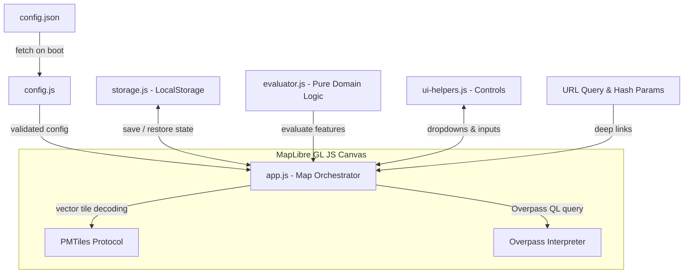

# Parkhour Developer Guide

This guide describes the architecture, module contracts, APIs, configuration schemas, and automated testing workflows for developers maintaining and extending **Parkhour**.

---

### Table of Contents
1. [Architecture Overview](#architecture-overview)
2. [Module Reference](#module-reference)
   - [`evaluator.js`](#evaluatorjs)
   - [`storage.js`](#storagejs)
   - [`ui-helpers.js`](#ui-helpersjs)
   - [`config.js` & `config.json`](#configjs--configjson)
   - [`app.js`](#appjs)
3. [Configuration Schema](#configuration-schema)
4. [Testing Strategy](#testing-strategy)
   - [Running Unit Tests (Vitest)](#running-unit-tests-vitest)
   - [Running End-to-End Tests (Playwright)](#running-end-to-end-tests-playwright)
   - [Code Coverage](#code-coverage)
5. [Data Pipeline & PMTiles Generation](#data-pipeline--pmtiles-generation)
6. [Design Considerations & Best Practices](#design-considerations--best-practices)

---

### Architecture Overview
Parkhour is built as a modular client-side Single Page Application (SPA) using ES Modules. Domain logic and storage persistence are cleanly decoupled from MapLibre GL JS canvas rendering and DOM listeners:



---

### Module Reference

#### `evaluator.js`
Pure, framework-agnostic domain logic for parking restriction parsing, curb evaluation, and tile coordinate calculations.

- **`parseConditional(str)`**:
  - Parses OpenStreetMap conditional strings (e.g. `no_parking @ (Mo-Fr 08:00-18:00); no_stopping @ (Mo-Fr 07:00-09:00)`).
  - Handles nested parentheses and multiple semicolon-separated rules.
  - Returns `Array<{ value: string, cond: string }>`.
- **`isProhibitive(val)`**:
  - Returns `true` if a restriction string represents a prohibitive regulation (`no_parking`, `no_stopping`, `private`, `permit`, `customers`, etc.).
- **`evaluateParkingLot(props, now)`**:
  - Resolves off-street parking lot accessibility using `access`, `parking:access`, and scheduled `opening_hours`.
  - Returns `{ status: "allowed"|"customers"|"restricted"|"unmapped", rule: string }`.
- **`evaluateSide(side, props, now)`**:
  - Evaluates street curb parking status for a given road side (`"left"` or `"right"`).
  - Evaluates active rules, upcoming rules starting later today (`restricted_today`), prohibitive default tags, and rules that expired earlier today.
  - Returns `{ status: "allowed"|"restricted_today"|"restricted"|"unmapped", rule: string }`.
- **`processFeatures(geojsonOrFeatures, evalTime)`**:
  - Transforms raw OSM features (from Overpass or PMTiles) into dual-curb street features and lot polygon features.
  - Returns a GeoJSON `FeatureCollection`.
- **`lon2tile(lon, zoom)` & `lat2tile(lat, zoom)`**:
  - Converts geographic coordinates into standard Web Mercator tile index numbers `(x, y)`.
- **`getUrlParam(params, ...keys)`**:
  - Retrieves a parameter value from `URLSearchParams` case-insensitively.

#### `storage.js`
Handles browser `localStorage` persistence and the 3-tier startup state resolution hierarchy.

- **`STORAGE_KEY`**: `"parkhour_user_settings_v1"`
- **`DEFAULT_VIEW`**: Built-in coordinate fallback (`center: [13.38761, 52.51556]`, `zoom: 16`).
- **`saveSettings(settings, storage)`**:
  - Persists settings (`dataSource`, `overpassUrl`, `pmtilesUrl`, `center`, `zoom`) to `localStorage`.
  - Defensively catches quota or security exceptions in private browsing modes.
- **`loadSettings(storage)`**:
  - Safely reads and parses persisted settings, returning `{}` on missing or corrupted data.
- **`parseUrlView(searchParams, hashParams)`**:
  - Extracts center coordinates and zoom levels from URL parameters or hash fragments.
- **`resolveInitialState(searchParams, hashParams, savedSettings, config)`**:
  - Implements the strict priority resolution:
    1. **URL Parameters** (highest priority).
    2. **Saved `localStorage` Settings** (medium priority).
    3. **`config.json` Defaults** (fallback).

#### `ui-helpers.js`
Provides reusable DOM helper functions for managing selectors and custom text inputs.

- **`populateDropdown(selectEl, items, currentUrl, customLabel)`**:
  - Populates a `<select>` element with preconfigured items plus a `"custom"` option.
  - Preselects the item matching `currentUrl` or defaults to custom.
- **`syncCustomInputVisibility(selectEl, inputEl, containerEl)`**:
  - Shows the custom URL input container when `"custom"` is selected, focusing the input; hides the container and updates input value when a preset is chosen.
- **`syncDropdownWithCustomInput(inputEl, selectEl, items)`**:
  - Dynamically updates the `<select>` value to match a preset if the user enters a known preset URL.

#### `config.js` & `config.json`
Static configuration loader and schema validator.

- **`DEFAULT_CONFIG`**: Hardcoded fallback values ensuring the app boots even if `config.json` is missing or unreachable.
- **`validateConfig(raw)`**: Sanitizes external JSON structures against expected field types.
- **`loadConfig(url, customFetch)`**: Asynchronously fetches and parses configuration from `config.json`.

#### `app.js`
The central orchestrator:
- Bootstraps MapLibre GL map instance using coordinates resolved from `storage.js`.
- Registers the PMTiles custom protocol (`maplibregl.addProtocol("pmtiles", protocol.tile)`).
- Manages vector line and fill layers (`street-centerline`, `parking-left-curb`, `parking-right-curb`, `parking-lots-fill`, `parking-lots-outline`).
- Listens to UI controls, dispatches queries, and updates map data.

---

### Configuration Schema
`config.json` at the project root configures default data sources and hosted presets:

```json
{
  "defaultDataSource": "pmtiles",
  "defaultPMTiles": "sac_core.pmtiles",
  "pmtilesAreas": [
    { "name": "Sacramento Core", "url": "sac_core.pmtiles" },
    { "name": "Northern California", "url": "norcal-260906.pmtiles" }
  ],
  "defaultOverpass": "https://overpass-api.de/api/interpreter",
  "overpassServers": [
    { "name": "Main OSM (overpass-api.de)", "url": "https://overpass-api.de/api/interpreter" },
    { "name": "Kumi Systems", "url": "https://overpass.kumi.systems/api/interpreter" },
    { "name": "French OSM Instance", "url": "https://overpass.openstreetmap.fr/api/interpreter" }
  ]
}
```

---

### Testing Strategy

#### Running Unit Tests (Vitest)
Unit tests execute fast in-memory tests verifying pure evaluation algorithms, conditional parsing, storage hierarchy, and UI helpers:

```bash
npm test
```

To run unit tests in watch mode:
```bash
npm run test:watch
```

#### Running End-to-End Tests (Playwright)
End-to-end tests launch a real headless Chromium browser, testing actual map canvas loading, DOM interactions, radio switching, and network request interception:

```bash
npm run test:e2e
```

#### Code Coverage
Generate unit test code coverage reports using the v8 provider:

```bash
npm run test:coverage
```

Current test coverage:
- `config.js`: 100% statements, 100% functions, 100% lines
- `evaluator.js`: 97.9% statements, 100% functions, 97.9% lines
- `storage.js`: 99.5% statements, 100% functions, 99.5% lines
- `ui-helpers.js`: 98.1% statements, 100% functions, 98.1% lines

---

### Data Pipeline & PMTiles Generation
To generate new PMTiles archives from OpenStreetMap PBF extracts:
1. Ensure prerequisites are installed via `./install_prereqs.sh` (`osmium-tool`, `tilemaker` or `planetiler`).
2. Run `./make_pmtiles.sh <input.osm.pbf> <output.pmtiles>`.
3. Add the resulting archive to `config.json` under `pmtilesAreas`.

---

### Design Considerations & Best Practices
- **Never Regenerate Files Unnecessarily:** Use surgical edits (`search_replace`, `multi_edit`) rather than rewriting files to preserve git history and minimize regression risk.
- **Defensive Error Handling:** Always wrap `localStorage` access in try/catch blocks to ensure seamless degraded operation in privacy-restricted browser modes.
- **Zero Heavy Transpilation:** Code uses standard ECMAScript modules natively supported by all modern browsers and Node 18+.
